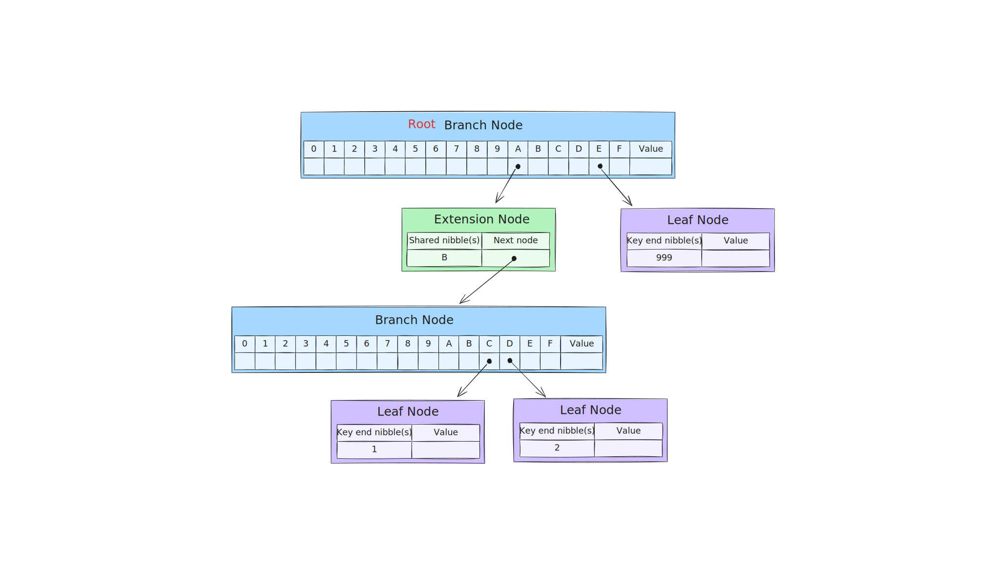

= Ethereum MPT Collapse - Tests for Risc0 Implementation

Ethereum's core data structure is a **modified Merkle-Patricia Trie (MPT)**, implemented by multiple clients (e.g. Geth, Reth). Unfortunately, there are limited resources discussing the internals of trie implementation - especially the **collapsing** process: the restoration of the canonical form when a branch is left with a single child, forming a so-called **orphaned branch**.

This repository is an effort to:

- Analyze possible cases of collapsing.
- Point out operations performed by `risc0-ethereum-trie`.
- Cross-check these cases against `alloy-trie` implementation.

TIP: You can reproduce all results by running `cargo test` - all the scenarios below are implemented as https://github.com/zenith-network/risc0-mpt-collapse/blob/master/src/lib.rs[unit tests].

== Test Scenarios

The behavior of an orphaned branch depends on its only child and its parent. Since Ethereum MPT consists of 3 node types - **branch**, **extension** and **leaf** - the following combinations should be analyzed:

- branch -> orphaned branch -> branch
- branch -> orhpaned branch -> extension
- branch -> orhpaned branch -> leaf
- extension -> orphaned branch -> branch
- extension -> orhpaned branch -> extension
- extension -> orhpaned branch -> leaf

NOTE: Cases where the "orphaned branch" is the root node are valid too, but already covered in the above superset.

Each case is cross-checked between `risc0-ethereum-trie` and `alloy-trie` implementations. Trie structure is additionally confirmed by debug printing Risc0 trie nodes (not shown here).

=== ✅ Case 1: branch -> orphaned branch -> branch

Example keys:

[source]
----
0xABC1
0xABD2
0xA0FF // <- just removed
0xE999
----

Trie representation:

image::./assets/case1-before.svg[width=800, height=450]

**Collapsing process:**

. Turn orphaned branch `B` into extension `B` - https://github.com/risc0/risc0-ethereum/blob/4a0f35ddccfb584493e751fe9e5f6515ec37c8c2/crates/trie/src/mpt/node.rs#L257-L262[code]

=== ✅ Case 2: branch -> orphaned branch -> extension

Example keys:

[source]
----
0xAB3C1
0xAB3D2
0xA0FFF // <- just removed
0xE9999
----

Trie representation:

**Collapsing process:**

. Turn orphaned branch `B` into child extension `3`, prefixed by the consumed `B` nibble - https://github.com/risc0/risc0-ethereum/blob/4a0f35ddccfb584493e751fe9e5f6515ec37c8c2/crates/trie/src/mpt/node.rs#L251-L256[code]

=== ✅ Case 3: branch -> orphaned branch -> leaf

Example keys:

[source]
----
0xAB1
0xA0F // <- just removed
0xE99
----

Trie representation:

**Collapsing process:**

. Turn orphaned branch `B` into child leaf `1`, prefixed by the consumed `B` nibble - https://github.com/risc0/risc0-ethereum/blob/4a0f35ddccfb584493e751fe9e5f6515ec37c8c2/crates/trie/src/mpt/node.rs#L245-L250[code]

image::./assets/case3-after.svg[width=800, height=450]

=== ✅ Case 4: extension -> orphaned branch -> branch

Example keys:

[source]
----
0xABC1
0xABD2
0xA0FF // <- just removed
----

Trie representation:

**Collapsing process:**

. Turn orphaned branch `B` into extension `B` - https://github.com/risc0/risc0-ethereum/blob/4a0f35ddccfb584493e751fe9e5f6515ec37c8c2/crates/trie/src/mpt/node.rs#L257-L262[code]
. Merge parent extension `A` with extension `B` https://github.com/risc0/risc0-ethereum/blob/4a0f35ddccfb584493e751fe9e5f6515ec37c8c2/crates/trie/src/mpt/node.rs#L220-L223[code]

=== ✅ Case 5: extension -> orphaned branch -> extension

Example keys:

[source]
----
0xAB3C1
0xAB3D2
0xA0FFF // <- just removed
----

Trie representation:

**Collapsing process:**

. Turn orphaned branch `B` into child extension `3`, prefixed by the consumed `B` - https://github.com/risc0/risc0-ethereum/blob/4a0f35ddccfb584493e751fe9e5f6515ec37c8c2/crates/trie/src/mpt/node.rs#L251-L256[code]
. Merge parent extension `A` with extension `B3` https://github.com/risc0/risc0-ethereum/blob/4a0f35ddccfb584493e751fe9e5f6515ec37c8c2/crates/trie/src/mpt/node.rs#L220-L223[code]

=== ✅ Case 6: extension -> orphaned branch -> leaf

Example keys:

[source]
----
0xAB1
0xA0F // <- just removed
----

Trie representation:

**Collapsing process:**

. Turn orphaned branch `B` into child leaf `1`, prefixed by the consumed `B` - https://github.com/risc0/risc0-ethereum/blob/4a0f35ddccfb584493e751fe9e5f6515ec37c8c2/crates/trie/src/mpt/node.rs#L245-L250[code]
. Merge parent extension `A` with leaf `B1` - https://github.com/risc0/risc0-ethereum/blob/4a0f35ddccfb584493e751fe9e5f6515ec37c8c2/crates/trie/src/mpt/node.rs#L216-L219[code]

image::./assets/case6-after.svg[width=800, height=450]

== Summary of Collapsing Rules

We could summarize the collapsing rules for Ethereum MPT as follows.

* **When a branch is left with only one child**, it is collapsed into:
** an **extension** if the child is a branch or extension,
** a **leaf** if the child is a leaf.

* **If the parent of the orphaned branch is an extension**, then after collapsing, the parent and child are merged into a single extension or leaf node with concatenated paths.

These rules ensure that the trie maintains a compact, canonical structure after deletions.

== Conclusion

The Risc0 trie implementation - `risc0-ethereum-trie` - correctly handles all possible collapsing scenarios, with the root hash consistent with the `alloy-trie` implementation.

== Next steps

We could test non-happy paths - for example, triggering a crash when collapsing a branch with one unresolved child (represented by digest node).
**Spoiler:** Risc0 handles this correctly, unlike the implementation in SP1's RSP.
