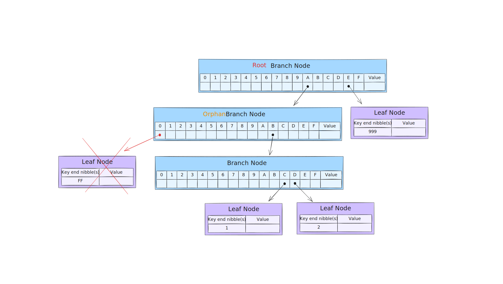

= Ethereum MPT Collapse - Tests for Risc0 Implementation

Ethereum's data structure is a **modified Merkle-Patricia Trie**, implemented by multiple clients e.g. Geth, Reth. Unfortunately, there are not many resources discussing trie implementation internals, especially the **collapsing** - process of bringing back the canonical form after branch is left with one child, so called **orphaned branch**.

This repository is an effort to:
- analyze possible cases for collapsing
- point out operations performed by `risc0-ethereum-trie`
- cross-check such cases with `risc0-ethereum-trie` implementation against `alloy-trie`.

== Scenarios

What happens to the orphaned branch is subject to its only child and its parent. Since there are 3 types of nodes in Ethereum MPT - branch, extension and leaf - we should analyze the following scenarios:

- branch -> orphaned branch -> branch
- branch -> orhpaned branch -> extension
- branch -> orhpaned branch -> leaf
- extension -> orphaned branch -> branch
- extension -> orhpaned branch -> extension
- extension -> orhpaned branch -> leaf

NOTE: Cases where "orphaned branch" is a root node is valid too, but it is already covered in above "superset".

Each case will be cross-checked between `risc0-ethereum-trie` and `alloy-trie` implementations.

=== ✅ Case 1: branch -> orphaned branch -> branch

Example keys:

[source]
----
0xABC1
0xABD2
0xA0FF // <- just removed
0xE999
----

Trie representation:

**Collapsing process:**

. Turn orphaned branch `B` into extension `B` - https://github.com/risc0/risc0-ethereum/blob/4a0f35ddccfb584493e751fe9e5f6515ec37c8c2/crates/trie/src/mpt/node.rs#L257-L262[code]

image::./assets/case1-after.svg[width=800, height=450]

=== ✅ Case 3: branch -> orphaned branch -> leaf

Example keys:

[source]
----
0xAB1
0xA0F // <- just removed
0xE99
----

Trie representation:

image::./assets/case3-before.svg[width=800, height=450]

**Collapsing process:**

. Turn orphaned branch `B` into child leaf prefixed by consumed `B` nibble - https://github.com/risc0/risc0-ethereum/blob/4a0f35ddccfb584493e751fe9e5f6515ec37c8c2/crates/trie/src/mpt/node.rs#L245-L250[code]

